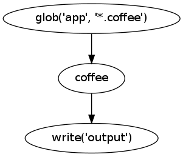

Environment
===========
The :class:`~pike.env.Environment` is a pretty lightweight class. It exists for
three main reasons: :ref:`env_organization`, :ref:`env_caching`, and :ref:`env_watching`.

.. _env_organization:

Organization
------------
The Environment serves as a single place to put all of your graphs. Create your
graphs, and then for each one call :meth:`pike.env.Environment.add`. You can
run all of your graphs with :meth:`pike.env.Environment.run_all`, or you can
run one at a time by passing the graph name to
:meth:`pike.env.Environment.run`.

.. todo::
    Document default_output for environment

.. _env_caching:

Caching
-------
The Environment will cache the output of the graphs. The first time you call
:meth:`~pike.env.Environment.run`, it will run the graph, cache the result, and
return the output. Each successive time, it will return the cached data. This
allows you to build your assets once and quickly reference them any time
thereafter.

You can also tell the Environment to cache the results to a file (using sqlite)
via the ``cache`` argument in the constructor. This makes it easy to retain the
cache and avoid rebuilding every time you restart the process.

.. _env_watching:

Watching
--------
The Environment also has some utilities to watch source files for changes. If
you pass in ``watch=True`` in the constructor, it will watch source files for
changes and rerun when changes are detected. It's very easy to continuously
build your assets like this:

.. code-block:: python

    env = pike.Environment(watch=True)
    with pike.Graph('app.coffee') as graph:
        pike.glob('app', '*.coffee') | pike.coffee() | pike.write('output')

    env.add(graph)
    env.run_forever()

While awesome, this feature is a little bit of black magic. What it's actually
doing behind the scenes is finding all source nodes in the graph (any node that
subclasses :class:`~pike.nodes.source.SourceNode`) and abusing it. It splices a
:class:`~pike.nodes.watch.ChangeListenerNode` and a
:class:`~pike.nodes.watch.ChangeEnforcerNode` after the sources. These two
nodes combined will fingerprint the files, watch for changes, and abort early
if no changes are detected.

No watching:

Watching:

There is one more component of file watching: the partial update. When you
:meth:`~pike.env.Environment.add` the graph to the Environment, you can pass in
``partial=True``. This will cause *only* the changed files to be passed
through. This can speed up the watch operation tremendously if you have a lot
of source files. If there is a direct one-to-one correlation between source and
output files, you can set ``partial=True`` and only rebuild the changed files.
The Environment still needs to retain a reference to the unchanged files, so a
:class:`~pike.env.watch.CacheNode` is appended to the end of the graph to fill
in the missing pieces.

