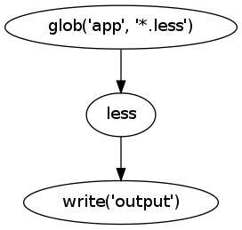
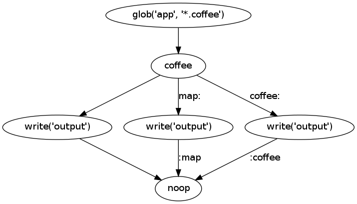

Getting Started
===============
Pike can be installed with pip

.. code-block:: bash

    pip install pike

Pike represents all operations as `directed acyclic graphs
<http://en.wikipedia.org/wiki/Directed_acyclic_graph>`_. These graphs are
comprised of nodes, each of which performs a single, isolated operation. Most
use cases will only require simple, linear graphs. Let's look at an example:

This graph will read in a bunch of `less <http://lesscss.org/>`_ files, compile
them into css, and write them to a directory. Let's look at how to create that
graph in pike:

.. code-block:: python

    with pike.Graph('app.less') as graph:
        pike.glob('app', '*.less') | pike.less() | pike.write('output')

The graph image was created with using graphviz and
:meth:`pike.graph.Graph.render`. But sometimes you need a more complicated
structure to represent what you want to do. Take the case of coffeescript. You
*could* create a coffeescript pipeline that looks the same as the less
pipeline:

.. code-block:: python

    with pike.Graph('app.coffee') as graph:
        pike.glob('app', '*.coffee') | pike.coffee() | pike.write('output')

This will write the javascript files, but during development it can be
immensely helpful to also have the ``.map`` and ``.coffee`` files available for
in-browser debugging. That graph looks a little more complicated:

.. code-block:: python

    with pike.Graph('app.coffee') as graph:
        coffee = pike.coffee()
        pike.glob('app', '*.coffee') | coffee
        # Write the js files
        coffee | pike.write('output') | graph.sink
        # Write the map files
        coffee * 'map' | pike.write('output') | 'map' * graph.sink
        # Write the coffee files
        coffee * 'coffee' | pike.write('output') | 'coffee' * graph.sink

There are more concise ways of creating this graph, but this representation is
easier to follow for now. Here is what the new graph looks like:

