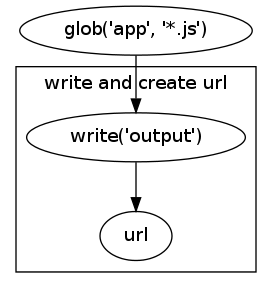
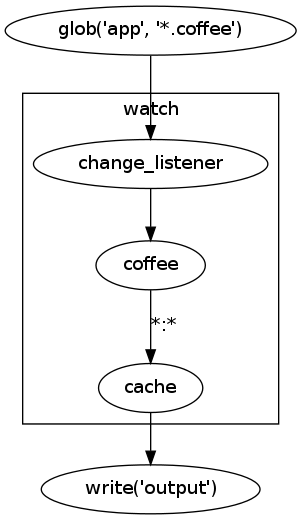

Graphs
======

Construction
------------
Building a graph is easy. Just create the graph, add the relevant nodes, and
finalize it.

.. code-block:: python

    graph = pike.Graph('mygraph')
    graph.add(pike.glob('.', '*.py')
    graph.finalize()

Finalizing is important. It does some validation checks on the nodes and edges,
and performs a topographical sort of the nodes. You will not be able to run the
graph until it is finalized. Speaking of, this is how you run a graph:

.. code-block:: python

    >>> graph.run()
    {'default': [File('main.py'), File('lib.py')]}

If the source node of the graph accepts inputs, then you may pass those in as
arguments to :meth:`~pike.graph.Graph.run`. Graphs will always return a
dictionary. The default dictionary key will be ``'default'``, but sometimes
it will return other named arguments such as ``'map'`` or ``'coffee'``. For
more details see :ref:`node_anatomy`.

There is a more concise way to create graphs, but it involves a bit of magic.
Let's create the same graph as above:

.. code-block:: python

    with pike.Graph('mygraph') as graph:
        pike.glob('.', '*.py')

Any nodes created inside the graph context will automatically be added to the
graph, and the graph will be finalized as it exits the context. This saves you
the trouble of typing all those extra characters, and it's readable, too!

Edges
-----
Edges tie the nodes of a graph together. Let's say we want to move all
javascript files from one directory to another. That is two operations: a read
and a write. So we need two nodes to complete those operations:

.. code-block:: python

    with pike.Graph('app.js') as graph:
        read = pike.glob('.', '*.js')
        write = pike.write('output')
        read.connect(write)

This takes the default output of the ``read`` node and hooks it up to the
default input of the ``write`` node. Again, there is a more concise way of
doing this:

.. code-block:: python

    with pike.Graph('app.js') as graph:
        pike.glob('.', '*.js') | pike.write('output')

The ``|`` operator can be chained, and the expression will always return the
last node in the list:

.. code-block:: python

    with pike.Graph('app.coffee') as graph:
        node = pike.glob('.', '*.coffee') | pike.coffee() | pike.write('output')
        # node will be the 'write' node, because that is last in the list

The same thing applies to ``|=``. The variable will be assigned the value of
the last node in the list.

.. code-block:: python

    with pike.Graph('app.coffee') as graph:
        node = pike.glob('.', '*.coffee')
        node |= pike.coffee() # node is now the 'coffee' node
        node |= pike.write('output') # node is now the 'write' node

Sometimes nodes can have multiple outputs or inputs. In the case of multiple
outputs, the node may have the default output and any number of named outputs.
Inputs work similarly, but they may also optionally take any number of unnamed
inputs. See :ref:`node_anatomy` for more details. 

Named edges can be useful if a single node produces more than one output. For
example, the coffeescript node produces javascript files and map files.

.. code-block:: python

    with pike.Graph('app.coffee') as graph:
        coffee = pike.glob('.', '*.coffee') | pike.coffee()
        coffee | pike.write('output') | graph.sink
        map_write = pike.write('output')
        coffee.connect(map_write, output_name='map')
        map_write.connect(graph.sink, input_name='map')

This pipes the javascript and the map file outputs through identical 'write'
nodes. Then it takes the output from those nodes and pipes it to the graph
sink. More on why the sink is necessary in :ref:`source_and_sink`.

Once more, you can also construct named edges using operator overloading. To
name an edge, multiply the node by a string before using the pipe. Note that
the order of the multiplication *does* matter. String on the left means
named-input. String on the right means named-output.

.. code-block:: python

    with pike.Graph('app.coffee') as graph:
        coffee = pike.glob('.', '*.coffee') | pike.coffee()
        coffee | pike.write('output') | graph.sink
        map_write = pike.write('output')
        coffee * 'map' | map_write
        map_write * 'map' | graph.sink

.. _source_and_sink:

Source and Sink
---------------
Each graph may have zero or one source nodes, and one sink node. The source
node is the node that handles any input arguments to
:meth:`pike.graph.Graph.run`. Many graphs will have no source nodes because
they will use nodes that generate the input, like the
:class:`~pike.nodes.source.GlobNode`. The tricky part is that each graph may
only have at most one source/sink node. It does its best to automatically
detect which node you intended to be the source, but sometimes you need to
define the structure manually.

During graph construction, there will be a ``graph.source`` and ``graph.sink``
node available. These will be instances of :class:`~pike.nodes.base.NoopNode`.
They will pipe all named and unnamed inputs into the exact same outputs; which
makes them perfect placeholders. If they are unused when the graph is
finalized, they will be removed.

Let's create a graph that will take two inputs: a list of javascript files and
a list of images. It will write each of those to the proper directory.

.. code-block:: python

    with pike.Graph('write_assets') as graph:
        graph.source * 'javascript' | pike.write('static/js')
        graph.source * 'images' | pike.write('static/img')

Now we can use this graph like so:

.. code-block:: python

    graph.run(javascript=js_files, images=img_files)

Modularity
----------
You saw above that you can create a graph that accepts input. You can also
treat graphs like any other node, which allows you to create reusable
components.

.. code-block:: python

    with pike.Graph('write and create url') as postfix:
        pike.write('output') | pike.url('url_prefix/')

    with pike.Graph('app.js') as js_graph:
        pike.glob('app', '*.js') | postfix

    with pike.Graph('app.css') as css_graph:
        pike.glob('app', '*.css') | postfix

Here is the ``js_graph`` from above:

Macros
^^^^^^
Using graphs as nodes is great if you have a component that defines an
end-to-end behavior. But sometimes you want to create a component that can wrap
or insert other components. For that, we have :class:`~pike.graph.Macro`'s.

.. code-block:: python

    # Create a macro that runs a node only on changed input files
    with pike.Graph('watch') as watcher:
        wrapped = pike.placeholder()
        pike.listen() | wrapped * '*' | '*' * pike.cache()

    watch = watcher.macro(wrapped)

    # Watch for changed coffeescript files
    with pike.Graph('app.coffee') as graph:
        p = pike.glob('app', '*.coffee')
        p |= watch(pike.coffee())
        p |= pike.write('output')

You can put any number of :class:`~pike.nodes.base.PlaceholderNode`'s inside of
a graph. Then you can create a macro by calling
:meth:`~pike.graph.Graph.macro` with the positional and keyword arguments that
will become the function signature of the macro.

Pretty Pictures
---------------
Sometimes it's helpful to be able to see what a graph actually looks like. And
for that, we have `graphviz <http://www.graphviz.org/>`_. There are three handy
methods to know about:

* :meth:`~pike.graph.Graph.dot` - Returns the dot syntax for drawing this graph
* :meth:`~pike.graph.Graph.render` - Shells out to the ``dot`` command to render an image
* :meth:`~pike.graph.Graph.show` - Attempts to auto-render and auto-open the image for you

All graphs in this documentation were generated with
:meth:`~pike.graph.Graph.render`.
